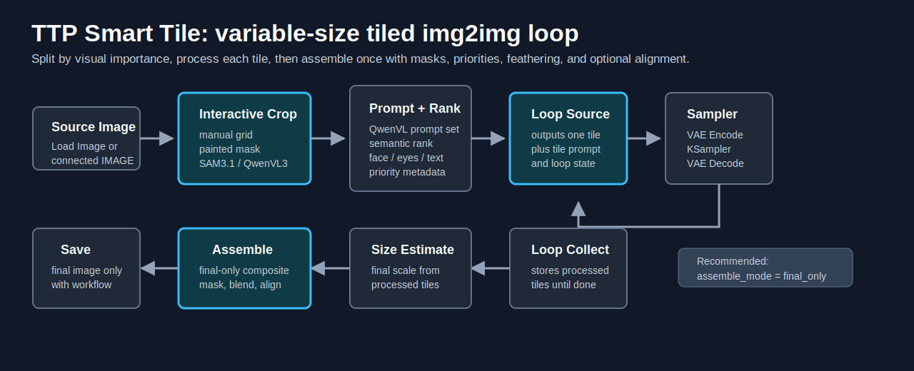
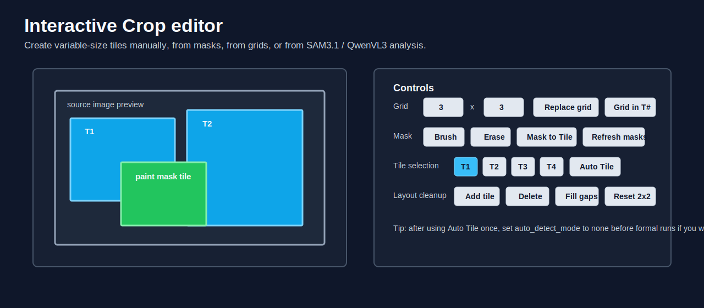
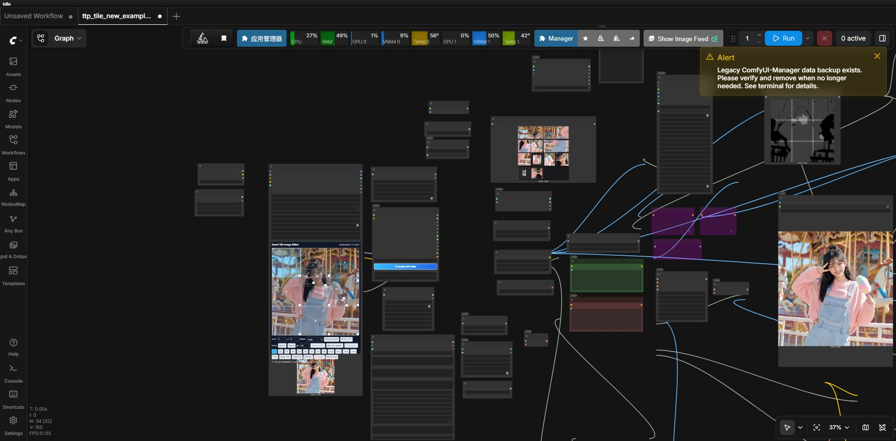
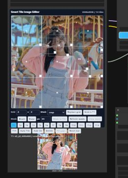
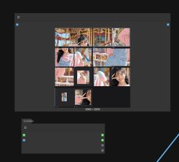
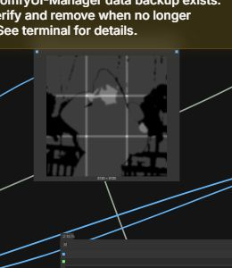
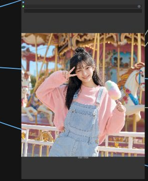
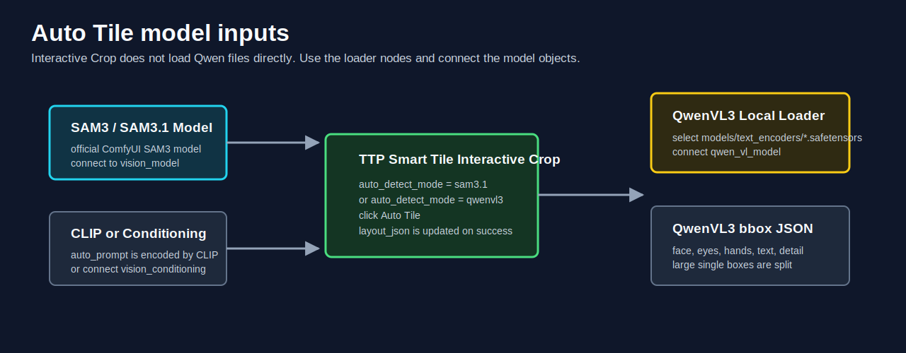
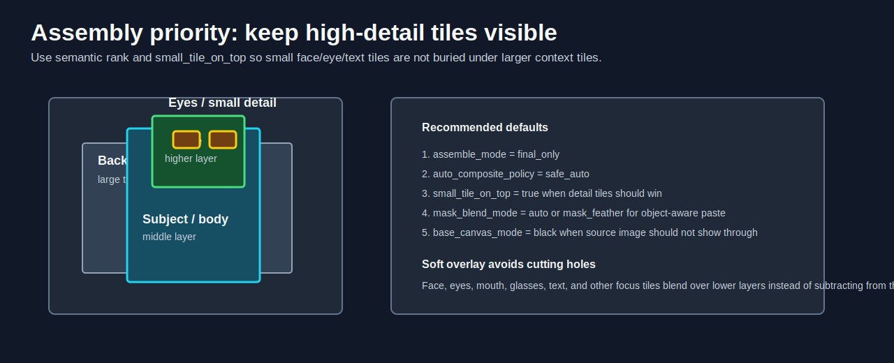

# **ComfyUI TTP Toolset**

ComfyUI TTP Toolset is a collection of tiled upscale, Smart Tile, video sampler, coordinate, and conditioning helper nodes. The current main feature is **Smart Tile 2.0**, an object-aware tiled img2img workflow with automatic layout, per-tile prompts, loop processing, semantic priority, mask-aware assembly, and final-only saving.

ComfyUI TTP Toolset 是一组围绕分块放大、Smart Tile、视频采样、坐标处理和条件处理的 ComfyUI 节点集合。当前主推功能是 **Smart Tile 2.0**：它支持语义自动分块、逐 tile 提示词、循环采样、语义层级、蒙版拼合和只保存最终结果。

## **Feature Blocks / 功能模块**

| Feature block / 功能块 | Status / 状态 | What it is for / 用途 |
|---|---|---|
| **Smart Tile 2.0** | Current main feature / 当前主推 | Object-aware variable-size tile workflow for detail img2img upscale. / 面向细节重绘放大的语义可变尺寸分块流程。 |
| **TTP Tile 1.0** | Legacy workflow / 旧版流程 | Fixed-grid image tiling and assembly for classic upscale workflows. / 传统固定网格切图、批处理和拼回流程。 |
| **TeaCache for Hunyuan Video** | Extra tool / 额外工具 | Faster Hunyuan Video sampling with TeaCache. / 使用 TeaCache 加速 Hunyuan Video 采样。 |
| **Coordinate and conditioning utilities** | Helper nodes / 辅助节点 | Coordinate splitting, condition batching, and condition merging. / 坐标拆分、条件批处理和条件合并。 |
| **LTX workflow examples** | Example workflows / 示例工作流 | First/last frame and middle-frame control examples. / 首尾帧与中间帧控制示例。 |

## **Smart Tile 2.0: Object-Aware Tile Loop / 语义分块循环**

**Smart Tile** is an object-aware tiled img2img workflow for ComfyUI. Instead of cutting every image into equal squares, it lets you build variable-size tiles around visual structure: face, eyes, hands, text, subject, clothing, foreground details, and background/context regions.



Smart Tile is designed for workflows where small areas need more detail than the full image. You can draw or auto-detect tiles, process one tile at a time through your sampler, then assemble the final image with feathering, masks, semantic priority, color correction, and optional pixel alignment.

#### **What It Solves**

- Avoids cutting important objects through the middle when a simple grid would split a face, hand, or text.
- Allows different tile sizes, so a face tile can be small and high detail while the background stays large.
- Sends one tile at a time through img2img, so the number of tiles can be 4, 8, 16, or anything produced by the editor.
- Keeps high-detail focus tiles visible during assembly with priority, layer, and semantic ranking.
- Supports mask-aware pasteback, soft detail overlay, final-only assembly, and black-base canvas mode.

#### **Visual Tile Editor**



`TTP Smart Tile Interactive Crop` is the recommended starting point. It can load an image like ComfyUI's official `Load Image`, or receive a connected `source_image`. The editor stores the current layout in a hidden `layout_json` widget, so your workflow keeps the tile plan.

Useful editor actions:

- `Replace grid`: replace the whole layout with an even grid.
- `Grid in T#`: subdivide the selected tile without rebuilding the whole layout.
- `Mask to Tile`: turn painted regions into object tiles.
- `Refresh masks`: after manually moving sub-tiles from a masked tile, re-crop the inherited masks to the current tile boxes.
- `Fill gaps`: add background tiles for uncovered areas.
- `Auto Tile`: run SAM3.1 or QwenVL3 detection and write the detected layout back into the editor.

When subdividing a masked tile with `Grid in`, the Mask mode can crop the original object mask into child tiles or skip empty mask children. The child tiles keep a parent mask source, so `Refresh masks` can update them after manual edits.

#### **Core Nodes**

| Node | Purpose |
|---|---|
| `TTP Smart Tile Interactive Crop` | Load/connect an image, create manual/painted/auto tiles, and output a variable-size `tile_set`. |
| `TTP Smart Tile Set Preview` | Preview a tile set as a contact sheet or one selected tile. |
| `TTP QwenVL3 Local Loader` | Load a local QwenVL tagging model from `ComfyUI/models/text_encoders`. |
| `TTP Smart Tile QwenVL Prompt Set Builder` | Generate per-tile prompts before loop processing. |
| `TTP Smart Tile Semantic Rank` | Classify tiles and write recommended layer, priority, scale weight, and composite metadata. |
| `TTP Smart Tile Loop Source` | Output one tile at a time for VAE Encode / sampler / VAE Decode. |
| `TTP Smart Tile Loop Collect` | Collect each processed tile back into the same tile set. |
| `TTP Smart Tile Image Upscale Prep` | Optionally upscale or resize each tile before sampling, with a megapixel cap. |
| `TTP Smart Tile Output Size Estimate` | Estimate final output scale/resolution from processed tile sizes. |
| `TTP Smart Tile Assemble` | Paste processed tiles back with feathering, masks, color correction, priority, optional GPU paste, and optional alignment. |
| `TTP Smart Tile Save Final Image` | Save only the final completed loop result and embed workflow metadata. |

#### **Recommended Loop Workflow**

```text
TTP Smart Tile Interactive Crop
  -> TTP Smart Tile QwenVL Prompt Set Builder (optional)
  -> TTP Smart Tile Semantic Rank (optional)
  -> TTP Smart Tile Loop Source
  -> VAE Encode / Sampler / VAE Decode
  -> TTP Smart Tile Loop Collect
  -> TTP Smart Tile Semantic Rank (optional final refresh)
  -> TTP Smart Tile Output Size Estimate (optional)
  -> TTP Smart Tile Assemble
  -> TTP Smart Tile Save Final Image
```

Use `TTP Smart Tile Loop Source` and `TTP Smart Tile Loop Collect` instead of manually duplicating sampler chains. The loop source outputs the current tile image and the current tile prompt. After the sampler finishes, loop collect stores the result and advances to the next tile.

By default, `TTP Smart Tile Assemble` uses `assemble_mode=final_only`. Connect `TTP Smart Tile Loop Collect.done` to `TTP Smart Tile Assemble.done` so unfinished loop runs return a lightweight preview while `done=false`, then perform the full assemble once after the last tile. Switch `assemble_mode` to `always` only when you really want a full recomposite after every tile. If pixel alignment is enabled, unfinished loop runs are automatically treated as final-only to avoid repeated expensive alignment passes.

#### **Complete Example Workflow / 完整范例工作流**

Example workflow / 示例工作流: [`examples/smart_tile_qwen_sam_loop_example_v2.json`](examples/smart_tile_qwen_sam_loop_example_v2.json)

这份工作流展示了当前推荐的 Smart Tile 完整链路：先用 `TTP Smart Tile Interactive Crop` 和 `sam3.1` 做 Auto Tile 分块，再用 `TTP Smart Tile QwenVL Prompt Set Builder` 生成每块提示词。随后 `Semantic Rank` 写入语义优先级，`Loop Source` 把 tile 一张一张送入 img2img，`Image Upscale Prep` 负责采样前放大，`Loop Collect` 收集结果，最后由 `Output Size Estimate` 估算画布尺寸，`Assemble` 在 `final_only` 模式下一次拼合，`Save Final Image` 只保存最终图。

This workflow is the recommended full Smart Tile loop. It uses `TTP Smart Tile Interactive Crop` with `sam3.1` Auto Tile, prepares per-tile prompts with `TTP Smart Tile QwenVL Prompt Set Builder`, ranks tiles with `Semantic Rank`, sends one tile at a time through img2img with `Loop Source`, upscales each tile before sampling with `Image Upscale Prep`, collects results with `Loop Collect`, estimates the final canvas with `Output Size Estimate`, assembles once in `final_only` mode, and saves only the completed result.

**Workflow overview / 工作流全景**



**Key views / 关键视图**

<table>
  <tr>
    <td width="50%"><strong>Interactive editor / 交互分块编辑器</strong><br></td>
    <td width="50%"><strong>Tile set preview / 分块预览</strong><br></td>
  </tr>
  <tr>
    <td width="50%"><strong>Weight preview / 权重预览</strong><br></td>
    <td width="50%"><strong>Final preview / 最终预览</strong><br></td>
  </tr>
</table>

**Key settings / 关键设置**

| Node / 节点 | Example setting / 示例设置 | Notes / 说明 |
|---|---|---|
| `Interactive Crop` | `auto_detect_mode=sam3.1`, `default_pad=32`, `default_blend=32`, `auto_object_padding=64`, `auto_max_tiles=16` | Use `Auto Tile` to create an object-aware layout, then set `auto_detect_mode=none` if you want to freeze manual edits. / 用 `Auto Tile` 生成语义分块；如果之后要固定手动编辑结果，可以把 `auto_detect_mode` 改回 `none`。 |
| `QwenVL3 Local Loader` | `qwen3vl_4b_fp8_scaled.safetensors` | Replace this with the QwenVL model installed in `ComfyUI/models/text_encoders`. / 按你本机 `models/text_encoders` 里的 QwenVL 模型替换。 |
| `QwenVL Prompt Set Builder` | `reference_image_mode=first_message`, `prompt_preset=tile_img2img_prompt`, `output_language=chinese` | Builds prompts before the tile loop, then `Loop Source.prompt` feeds the text encoder. / 在循环前一次性生成每块提示词，然后由 `Loop Source.prompt` 送入文本编码。 |
| `Image Upscale Prep` | `scale=2.5`, `round_to=8`, `max_megapixels=1.5`, `use_upscale_model=true` | Enlarges each tile before img2img while keeping each tile under the megapixel cap. / 采样前放大每块 tile，同时用百万像素上限控制显存。 |
| `Loop Source` / `Loop Collect` | `Process All Tiles` workflow | The tile count can be 4, 8, 16, or any layout count; no manual sampler duplication is needed. / 分块数量可以变化，不需要手动复制多套 sampler。 |
| `Output Size Estimate` | `focus_weighted` | Estimates the final canvas from processed tile sizes, giving more influence to focus/detail tiles. / 根据处理后的 tile 尺寸估算最终画布，并更重视细节块。 |
| `Assemble` | `assemble_mode=final_only`, `mask_blend_mode=mask_feather`, `color_correction=histogram`, `small_tile_on_top=true`, `auto_composite_policy=safe_auto` | Assembles only after the loop is done, uses mask-aware feathering, and keeps small detail tiles above larger context tiles. / 循环结束后只拼合一次，使用蒙版羽化，并让小细节块优先于大背景块。 |

Before running the example, replace model filenames such as the diffusion model, CLIP/text encoder, VAE, LoRA, and upscale model with files installed on your machine. The workflow is meant as a wiring reference; model choices can be changed freely.

运行示例前，请把 diffusion model、CLIP/text encoder、VAE、LoRA、upscale model 等模型名替换成你本机已经安装的文件。这份工作流主要作为连线参考，具体模型可以自由替换。

#### **Auto Tile: SAM3.1 or QwenVL3**



`auto_detect_mode` controls how `Auto Tile` analyzes the image:

| Mode | Required input | Notes |
|---|---|---|
| `none` | none | Auto Tile is disabled; use manual grid, painted masks, or saved layout. |
| `sam3.1` | official SAM3/SAM3.1 model to `vision_model`, plus `CLIP` or `vision_conditioning` | Uses ComfyUI's official SAM3 Detect path. The built-in `auto_prompt` is encoded internally when `clip` is connected. |
| `qwenvl3` | `TTP QwenVL3 Local Loader -> qwen_vl_model` | Uses QwenVL for bbox JSON. Model files are selected from `ComfyUI/models/text_encoders`. If Qwen returns one large full-frame box, Smart Tile splits it into useful detail tiles. |

For QwenVL3, `TTP Smart Tile Interactive Crop` does not read `.safetensors` directly. Add `TTP QwenVL3 Local Loader`, choose the QwenVL model file, then connect its `qwen_vl_model` output into Interactive Crop.

`auto_max_tiles` limits the total Auto Tile layout after automatic gap filling, so detected objects and generated background gap tiles stay within the same cap.

#### **Per-Tile Prompts**

For manual prompt workflows, connect `TTP Smart Tile Loop Source.prompt` to your text encoder path. For automatic prompt workflows, place `TTP Smart Tile QwenVL Prompt Set Builder` before the loop:

```text
Interactive Crop
  -> QwenVL Prompt Set Builder
  -> Semantic Rank
  -> Loop Source
```

The prompt builder can use a full image, every tile, or a contact sheet as QwenVL visual context. It caches results by model file, tile hash, prompts, and seed, so reruns do not need to interrogate unchanged tiles again.

#### **Upscale Prep and Size Estimate**

`TTP Smart Tile Image Upscale Prep` prepares each loop tile before img2img sampling. It can use a connected ComfyUI `UPSCALE_MODEL` through the same tiled upscale-model path as the built-in upscale node, or fall back to `lanczos`, `bicubic`, `bilinear`, `area`, or nearest resize when no model is connected or `use_upscale_model` is off. `scale` sets the requested enlargement, `max_megapixels` caps the final tile pixel count, and `round_to` snaps the final width/height after the cap. When the cap is active, the node rounds down so the rounded tile stays under the megapixel budget. Tile coordinates are not changed; they remain in original-image space so assemble can map the processed tile back by `sample_box` and `output_scale`.

`TTP Smart Tile Output Size Estimate` reads the processed `tile_set` after `Loop Collect` and reports `output_scale`, final `width`/`height`, separate `scale_x`/`scale_y`, and a per-tile info log. The default `median` strategy matches Assemble's automatic tile-scale inference, and the `output_scale` output can be connected directly to `TTP Smart Tile Assemble.output_scale`. `focus_weighted` uses semantic scale weights so low-detail full/background tiles do not drag the final-only canvas scale below high-detail face/eye/text tiles. For final-only loops, connect `TTP Smart Tile Loop Collect.done` to both this node's `done` input and `TTP Smart Tile Assemble.done`; while `done=false`, this node returns a deferred zero-scale placeholder and skips tile scanning, then estimates once when `done=true`. Mixed tile scales are reported in the info string so capped or unevenly enlarged tiles are visible before final assembly.

#### **Assembly, Masks, and Layer Priority**



`TTP Smart Tile Semantic Rank` is optional, but useful after QwenVL prompting or auto/manual tile creation. It classifies each tile as background, subject, face, eyes, hands, text, detail, or normal from existing labels/captions/prompts, then writes semantic score, scale weight, recommended layer, priority, occlusion priority, and composite mode metadata back into the tile set. With `apply_composite_rank` on, face/eyes/text/detail tiles are promoted above background/context tiles and are marked for soft overlay blending.

Assembly options worth starting with:

| Setting | Suggested value | Why |
|---|---|---|
| `assemble_mode` | `final_only` | Assemble once when the loop is complete; much faster than recompositing every step. |
| `assemble_device` | `auto` or `gpu` | Uses GPU paste/weight accumulation when available. |
| `base_canvas_mode` | `black` when you do not want source pixels underneath | Prevents the original image from showing through uncovered or low-weight areas. |
| `auto_composite_policy` | `safe_auto` | Keeps background/context low and promotes focus/detail tiles. |
| `small_tile_on_top` | `true` for detail workflows | Helps small face/eye/text tiles win overlaps against larger body/context tiles. |
| `mask_blend_mode` | `auto` or `mask_feather` | Uses object masks when present and feathered rectangular masks otherwise. |
| `color_correction` | `off` first, then `reinhard_lab`, `mkl_lab`, or `histogram` as needed | Uses ComfyUI's official Transfer Color logic; reference defaults to the source image. |

Detail tiles should blend over lower layers instead of cutting holes into them. The safe auto policy treats face, eyes, mouth, glasses, text, and similar focus regions as soft overlays when possible.

#### **Recommended Starting Parameters**

| Scenario | Recommended settings |
|---|---|
| General manual grid | `grid=3x3`, `default_pad=32`, `default_blend=32` or `64`, `round_to=8`, `include_full_image=false` |
| Portrait/detail workflow | Auto Tile + Qwen/SAM prompt for `person, face, eyes, hands, text, foreground object` |
| Variable-size detail tiles | Use `TTP Smart Tile Image Upscale Prep` before sampler, then `Output Size Estimate` before Assemble |
| Avoid original image leaking through | `base_canvas_mode=black` |
| Small details should stay visible | `small_tile_on_top=true`, `auto_composite_policy=safe_auto` |
| Expensive alignment workflow | `assemble_mode=final_only`, connect `done` from Loop Collect |
| Strict manual layout | Keep Auto Tile mode as `none` after you finish editing, so formal runs do not replace your layout |

#### **Troubleshooting**

| Symptom | What to check |
|---|---|
| Auto Tile did not change the layout | Make sure `auto_detect_mode` is `sam3.1` or `qwenvl3`, the required model input is connected, then read the editor status message. |
| QwenVL3 does not split the image | Confirm `TTP QwenVL3 Local Loader` is connected to `qwen_vl_model`. Qwen must return bbox JSON; Smart Tile accepts common `bbox`, `bbox_2d`, `box_2d`, `objects`, and `xywh` formats. |
| Running the full workflow replaces manual edits | Set `auto_detect_mode=none` after Auto Tile if you only wanted detection once, then manually edit the saved layout. |
| A manually moved mask tile still uses the old mask | Click `Refresh masks` after moving Grid-in child tiles from a masked parent. |
| Native Save Image saves multiple loop frames | Use `TTP Smart Tile Save Final Image`; loop previews are not treated as final output. |
| Face or eyes are hidden under a larger tile | Use `TTP Smart Tile Semantic Rank`, enable `small_tile_on_top`, and keep `auto_composite_policy=safe_auto`. |
| The original image shows through | Use `base_canvas_mode=black` and make sure `Fill gaps` has covered empty regions. |
| Assemble is slow | Use `assemble_mode=final_only`; avoid repeated pixel alignment during unfinished loop steps. |

#### **Advanced Layout JSON**

Example layout:

```json
{
  "defaults": {
    "pad": 128,
    "blend": 48,
    "priority": 50,
    "importance": 1.0
  },
  "tiles": [
    {
      "name": "full_image",
      "x": 0,
      "y": 0,
      "w": 1.0,
      "h": 1.0,
      "pad": 0,
      "blend": 96,
      "priority": 10,
      "importance": 0.5
    },
    {
      "name": "face",
      "x": 0.35,
      "y": 0.08,
      "w": 0.30,
      "h": 0.28,
      "pad": 192,
      "blend": 64,
      "priority": 100,
      "importance": 1.0
    }
  ]
}
```

Coordinates can be pixel values or normalized values from `0.0` to `1.0`. A rectangle whose coordinates are all in `0..1` is treated as normalized, including browser-serialized `0` and `1` edges. `pad` is seam overlap: it expands only the tile edges that touch another tile. Outer canvas edges and non-adjacent gap edges are not expanded. `blend`, `priority`, and `importance` control how the sampled tile is pasted back.

For standard grid layouts, edge tiles are expanded inward with real source pixels when needed so the ComfyUI `IMAGE` batch has a consistent size without fake outer padding. Irregular manual layouts with uncovered gaps may still need transport padding because a single `IMAGE` batch cannot contain mixed image sizes.

## **TTP Tile 1.0: Fixed-Grid Upscale Workflow / 旧版固定网格放大流程**

TTP Tile 1.0 is the original fixed-grid upscale workflow. It cuts an image into equal-size tiles, processes them as a batch, then assembles them back into the original layout. This path is still useful for classic Flux, Hunyuan, SD3, and ControlNet Tile upscale workflows where a regular grid is enough.

TTP Tile 1.0 是这个项目最早的固定网格分块放大流程。它把图片切成等尺寸 tile，批量处理后再按原始位置拼回去。对于传统 Flux、Hunyuan、SD3、ControlNet Tile 等固定网格放大场景，它依然很实用。


### **1. Image Tile Batch Node**
This node cuts an image into pieces automatically based on your specified width and height. It also records the necessary information for further processing.

| Parameter | Description                         |
|-----------|-------------------------------------|
| **Width** | The width of each tile.            |
| **Height** | The height of each tile.           |
| **Image** | The image to be tiled.             |

**Node View**:


---

### **2. Image Assembly Node**
This node reassembles image tiles back into a complete image while preventing visible lines between the tiles. It operates in pixel mode.

| Parameter   | Description                                                   |
|-------------|---------------------------------------------------------------|
| **Tiles**   | Input the tiled image batch. Replace individual tiles if needed. |
| **Position** | Paired with the Image Tile Batch Node.                        |
| **Original Size** | Paired with the Image Tile Batch Node.                  |
| **Grid Size** | Paired with the Image Tile Batch Node.                      |
| **Padding** | The padding value used to merge the image pieces.             |

**Node View**:


---

### **3. Tile Image Size Node**
This node calculates the resolution of each tile based on the original image dimensions and your specified width/height factors.

| Parameter         | Description                                                        |
|-------------------|--------------------------------------------------------------------|
| **Width Factor**  | Divides the image width into equal parts.                          |
| **Height Factor** | Divides the image height into equal parts.                         |

For example: A width factor of `2` and a height factor of `3` will divide the image into `6` equal tiles.

**Node View**:


---

## **TTP Tile 1.0 Examples / 旧版示例**

### **Pixel Example (Recommended)**


### **Latent Example**


---

### **ControlNet Tile Integration**
This workflow supports **ControlNet Tile** for enhanced upscaling. Here's an example of using tiles with the **Hunyuan DIT** model:

| Resource | Link                                                                                          |
|----------|-----------------------------------------------------------------------------------------------|
| **Tile Example** | [Hugging Face Tile](https://huggingface.co/TTPlanet)                                  |
| **Hunyuan 1.2**  | [Download Hunyuan 1.2](https://huggingface.co/comfyanonymous/hunyuan_dit_comfyui/blob/main/hunyuan_dit_1.2.safetensors) |

**Workflow Example**:


---

## **Other Tools / 其他功能**

This section collects smaller tools and workflow helpers that are not part of the new Smart Tile 2.0 loop or the legacy TTP Tile 1.0 fixed-grid pipeline.

这一部分收纳不属于 Smart Tile 2.0 主流程、也不属于 TTP Tile 1.0 固定网格主流程的零散工具和辅助工作流。

### **TeaCache Sampler for Hunyuan Video / Hunyuan Video TeaCache 采样器**

Thanks to the TeaCache repository ([ali-vilab/TeaCache](https://github.com/ali-vilab/TeaCache)) and references from [facok/ComfyUI-TeaCacheHunyuanVideo](https://github.com/facok/ComfyUI-TeaCacheHunyuanVideo), this toolset includes TeaCache sampler support for Hunyuan Video workflows.

TeaCache can speed up Hunyuan Video sampling. In earlier testing on an NVIDIA 4090, a 720x480 video with 65 frames took about 55 seconds with a speedup factor around `x2.1`. Quality and motion can change when acceleration is too high, so tune it carefully.

本项目参考 TeaCache 仓库和相关 ComfyUI 实现，为 Hunyuan Video 工作流提供 TeaCache 采样器支持。它可以明显加速视频采样，但加速倍率过高时可能影响画质和动态效果，需要按项目调节。


https://github.com/user-attachments/assets/af06b9d3-9c84-4a83-ba90-eb4ec4bb2e99

### **LTX Frame Control Workflows / LTX 首尾帧与中间帧控制**

The `examples/` folder also includes LTX workflow examples for first/last frame and middle-frame control. These are separate workflow helpers and are not required for Smart Tile.

`examples/` 目录里还包含 LTX 首尾帧、中间帧控制相关工作流示例。这些属于独立工作流辅助功能，不是 Smart Tile 的必需部分。

### **Coordinate and Conditioning Utilities / 坐标与条件辅助节点**

#### **Coordinate Splitter Node**
This node converts position information into coordinates and connects them to the corresponding positions.

**Node View**:


---

#### **Cond to Batch Node**
This node converts condition lists into batches. It is reserved for future functionality expansion and connects to the conditions.

**Node View**:


---

#### **Condition Merge Node**
This node merges all tiled conditions into one and prepares them for building the final image. It connects to the **Coordinate Splitter Node** and **Cond to Batch Node**.

**Node View**:


---


## **Star History**
<a href="https://star-history.com/#TTPlanetPig/Comfyui_TTP_Toolset&Date">
 <picture>
   <source media="(prefers-color-scheme: dark)" srcset="https://api.star-history.com/svg?repos=TTPlanetPig/Comfyui_TTP_Toolset&type=Date&theme=dark" />
   <source media="(prefers-color-scheme: light)" srcset="https://api.star-history.com/svg?repos=TTPlanetPig/Comfyui_TTP_Toolset&type=Date" />
   
 </picture>
</a>
